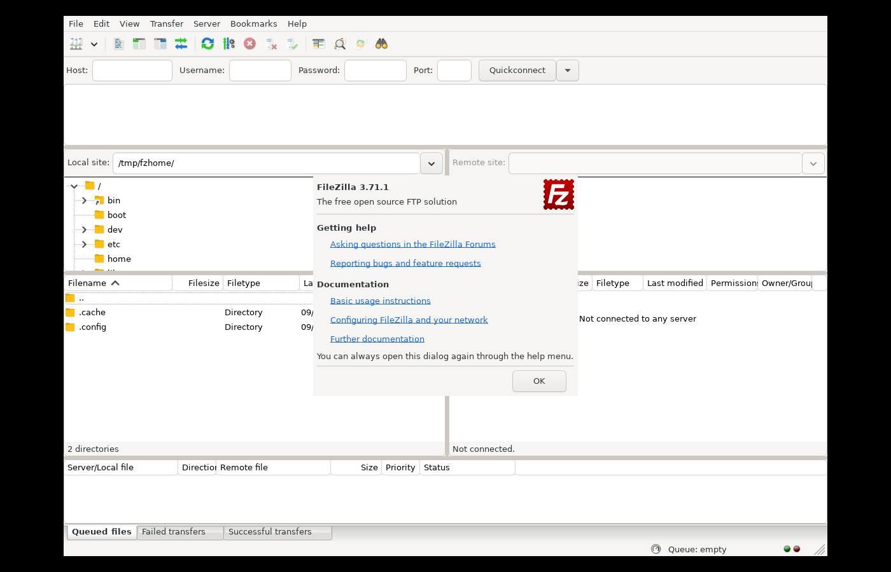
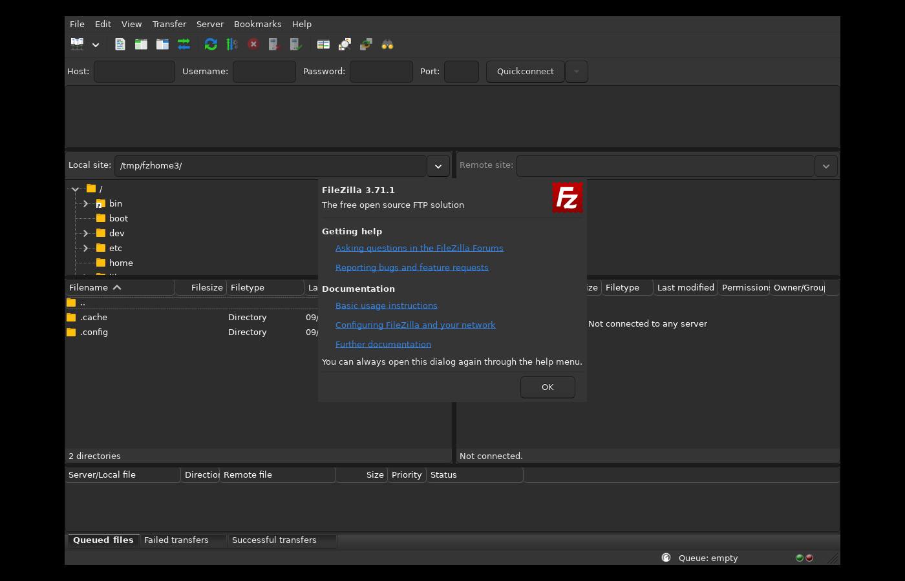

# FileZilla Modern (unofficial fork)

This is an **unofficial**, community-maintained fork of the
[FileZilla](https://filezilla-project.org/) FTP/FTPS/SFTP client, focused on
fixing dark-mode/theming gaps and giving the GUI a flatter, more modern look
**on Linux**. It is not affiliated with, endorsed by, or supported by the
FileZilla Project or Tim Kosse.

Base: FileZilla3 SVN trunk, upstream revision 11557.

| Light (system GTK theme) | Dark (`GTK_THEME=Adwaita:dark`) |
| --- | --- |
|  |  |

See [CHANGES-FORK.md](CHANGES-FORK.md) for the exact list of modifications
made to the upstream source, as required by the GPL.

## Why this exists

Distro-packaged FileZilla builds are often years behind upstream trunk and
ship with inconsistent dark-theme support and a dated, beveled GTK2-era
look. This fork:

- Builds against current wxWidgets 3.2 (GTK3), which already fixed most
  dark-mode color handling upstream but rarely reaches users via distro
  packages.
- Fixes the couple of remaining hardcoded (non-theme-aware) colors that
  broke dark mode in list/focus rendering.
- Ships a small structural GTK3 CSS layer (flatter toolbar buttons, slimmer
  scrollbars, rounded tabs/entries) that layers on top of *whatever* GTK
  theme you have selected — light or dark — without overriding your theme's
  colors.
- Uses the already-modern, high-resolution flat default icon set from
  upstream trunk (most stable/distro builds still ship the old icon set).

## Building on Linux

Dependencies (Debian/Ubuntu package names):

```
build-essential pkg-config autoconf automake libtool git \
libfilezilla-dev (>= 0.57.0) libfzssh-dev (>= 1.4.0) libwxgtk3.2-dev (>= 3.2.1) \
libgnutls28-dev libsqlite3-dev nettle-dev libidn2-dev libgtk-3-dev \
libboost-regex-dev libboost-dev gettext xdg-utils
```

On Debian sid/trixie these are all available directly via `apt`. On older
Ubuntu releases, `libfilezilla-dev` and `libfzssh-dev` are too old and must
be built from source:

- libfilezilla: `https://svn.filezilla-project.org/svn/libfilezilla/trunk` (autotools)
- fzssh: `https://salsa.debian.org/debian/fzssh` (meson)

Then:

```sh
autoreconf -fi
./configure --with-pugixml=builtin
make -j$(nproc)
sudo make install
```

See `.github/workflows/build-linux.yml` for a known-working CI build on
`debian:sid`.

## License

GPL-2.0-or-later, unchanged from upstream. See [COPYING](COPYING).
Original upstream README preserved at
[UPSTREAM-README.txt](UPSTREAM-README.txt).
